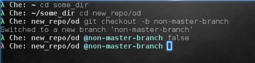

# DenineS oh-my-zsh Theme
A short and descriptive oh-my-zsh Theme with git support.

##### Features
* color of the lambda inicates success of last command
* short pwd with root at home or last git repository
* show if on non-main/master branch
* Hostname restricted to 3 first characters
